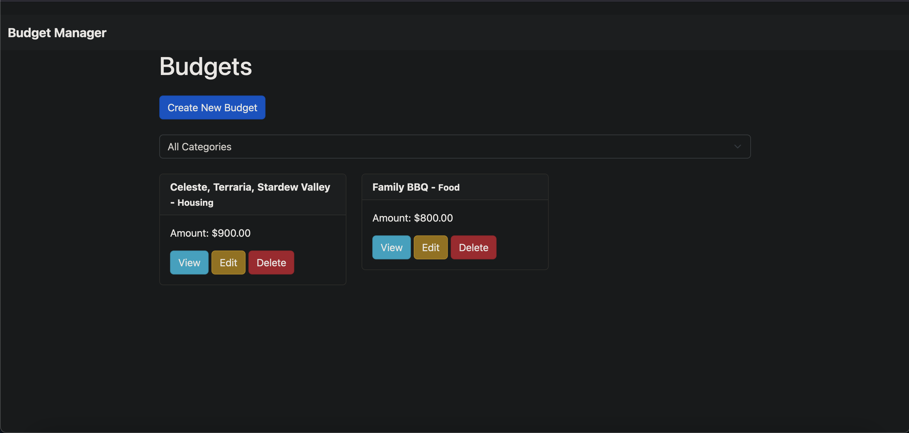
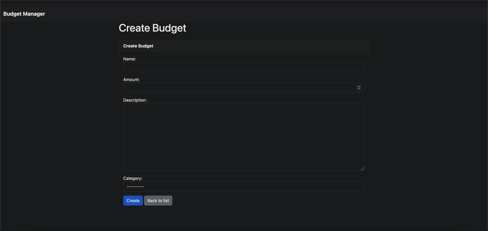
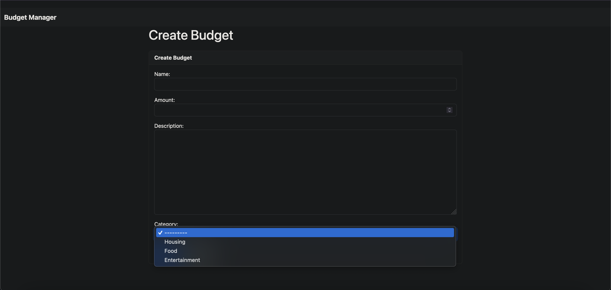
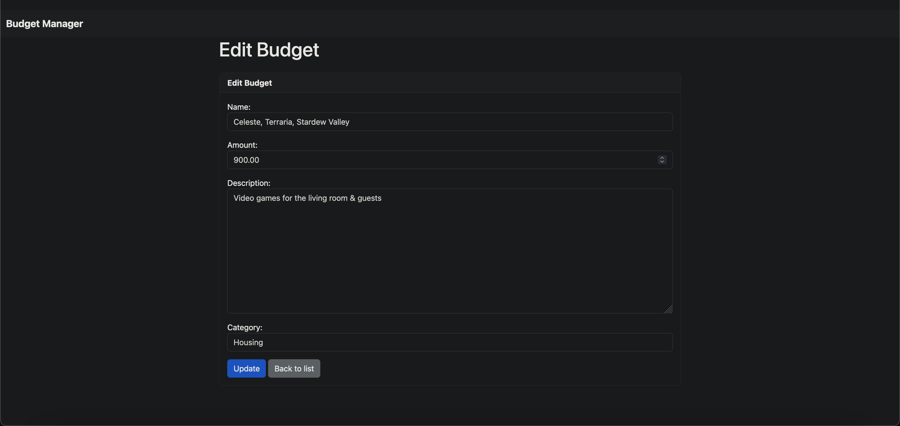
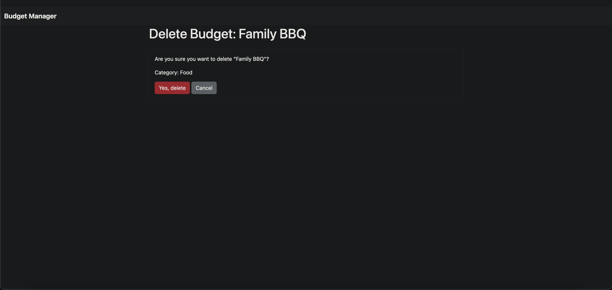

# Budget Manager

## Overview

**Budget Manager** is a Django-based web application designed to help users manage their budgets by providing CRUD (Create, Read, Update, Delete) operations on budget entries. Users can categorize their budgets, view them, and perform various operations to manage their financial records effectively.

## Features

- **CRUD Operations**: Create, read, update, and delete budget entries.
- **Categorization**: Categorize budgets for easier management.
- **Responsive Design**: Built with Bootstrap for mobile-friendly, responsive design.
- **Search & Filter**: Filter budgets by categories.

## Table of Contents

- [Installation](#installation)
- [Configuration](#configuration)
- [Usage](#usage)
- [Screenshots](#screenshots)
- [Contributing](#contributing)
- [License](#license)

## Installation

### Prerequisites

- Python 3.9+
- Django 4.2.13+
- Virtual environment (recommended)

### Steps

1. **Clone the repository**:

   ```bash
   git clone https://github.com/yourusername/budget-manager.git
   cd budget-manager
   ```

2. **Create and activate a virtual environment**:

   ```bash
   python -m venv venv
   source venv/bin/activate  # On Windows use `venv\Scripts\activate`
   ```

3. **Install dependencies**:

   ```bash
   pip install -r requirements.txt
   ```

4. **Run migrations**:

   ```bash
   python manage.py migrate
   ```

5. **Create superuser**:

   ```bash
   python manage.py createsuperuser
   ```

6. **Load initial categories (optional)**:

   If you’ve added a fixture or custom command for initial data, load it now:

   ```bash
   python manage.py loaddata initial_data.json  # or `python manage.py add_categories`
   ```

7. **Run the development server**:

   ```bash
   python manage.py runserver
   ```

   Visit `http://127.0.0.1:8000` in your browser to access the app.

## Configuration

### Django Settings

- **Database**: Modify the `DATABASES` setting in `settings.py` to configure your database.
- **Static Files**: Make sure `STATIC_URL` and `STATICFILES_DIRS` are properly set up.

### Environment Variables

You can use environment variables to manage sensitive information:

- **`.env` file**: Use a `.env` file to store environment-specific settings.

### Example `.env` file

```env
DEBUG=True
SECRET_KEY=your_secret_key
DATABASE_URL=sqlite:///db.sqlite3
```

## Usage

### Access the Admin Interface

Navigate to `http://127.0.0.1:8000/admin` and log in with the superuser credentials you created.

### Adding Categories

Use the admin interface or run a custom management command to add budget categories.

### Managing Budgets

- **Create Budget**: Click on "Add Budget" and fill out the form.
- **View Budgets**: View all budgets on the main page.
- **Update Budget**: Click on "Edit" to modify an existing budget.
- **Delete Budget**: Click on "Delete" to remove a budget.

## Screenshots

### Budget List Page



### Add Budget Page




### Edit Budget Page




## License

This project is licensed under the CC0 - see the [LICENSE](LICENSE) file for details.
